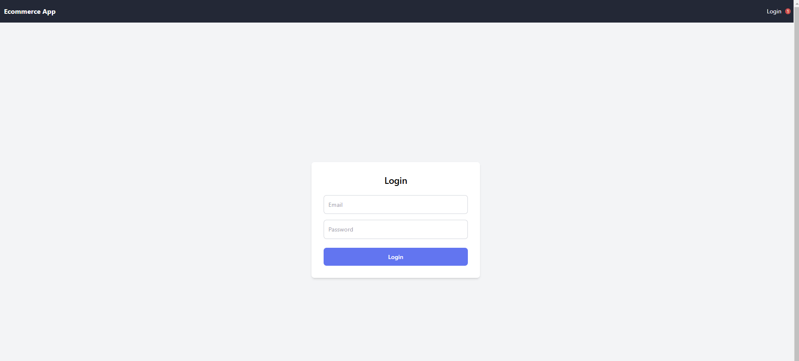
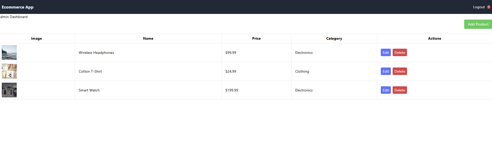
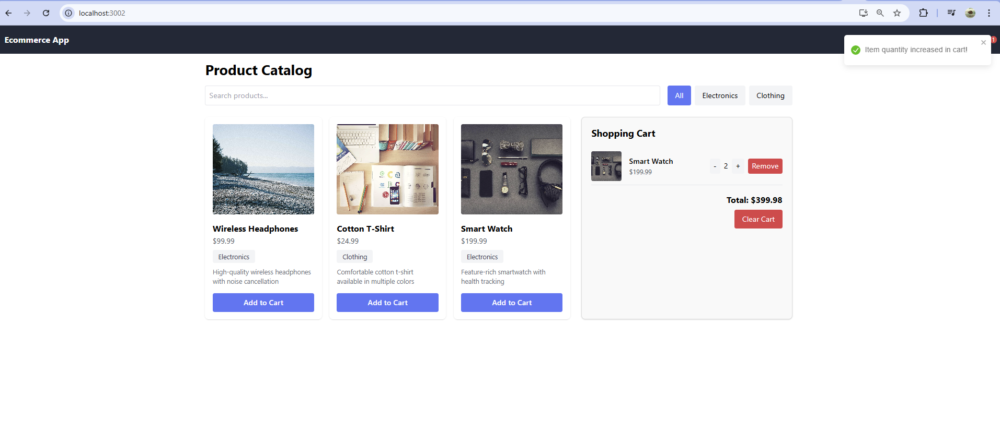
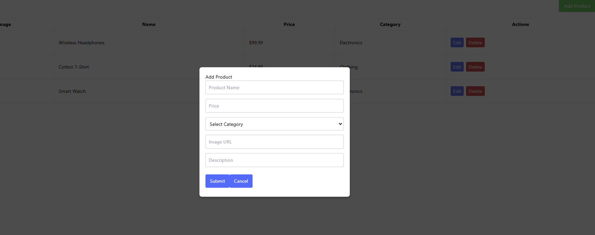
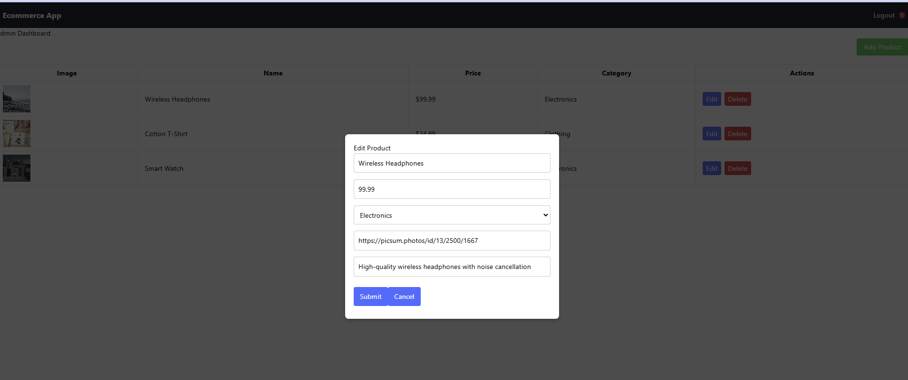

# E-commerce Application

This is a simple E-commerce application built with React. It includes features for product management, cart functionality, user authentication, and admin dashboard.

## Table of Contents
- [Login Instructions](#login-instructions)
- [Setup and Run Instructions](#setup-and-run-instructions)
- [File Structure](#file-structure)
- [Tools Used](#tools-used)
- [Screenshots](#screenshots)

## Login Instructions

- **Admin Credentials:**
  - Email: `admin@gmail.com`
  - Password: `Admin@123`

- **User Credentials:**
  - Email: `user@gmail.com`
  - Password: `User@123`

## Setup and Run Instructions

To set up and run this project locally, follow these steps:

1. **Clone the Repository**
   ```bash
   git clone https://github.com/owuorvin/ecommerce.git

## Navigate to the Project Directory

cd ecommerce

Install Dependencies Ensure you have Node.js and npm installed. Then run:

npm install

## Set Up Firebase

   --Create a Firebase project at Firebase Console.
   --Set up Firestore and Authentication.
   --Replace the configuration in firebaseConfig.js with your Firebase project credentials.

Run the Application Start the development server:

npm start

Open in Browser Navigate to http://localhost:3000 in your web browser to view the application.

## File Structure

src/
|-- atoms/
|   |   |-- cartState.js
|-- components/
|   |-- Product/
|   |   |-- ProductCard.js
|   |   |-- FilterBar.js
|   |-- Cart/
|   |   |-- ShoppingCart.js
|   |   |-- CartItem.js
|   |-- Auth/
|   |   |-- Auth.js
|   |-- Admin/
|   |   |-- Modal.js
|   |   |-- ProductTable.js
|   |-- General/
|   |   |-- Notfication.js
|   |   |-- TopBar.js
|-- contexts/
|   |   |-- AuthContext.js
|-- pages/
|   |   |-- Admin.js
|   |   |-- EcommerceApp.js
|   |   |-- Login.js
|-- services/
|   |   |-- api.js
|   |   |-- authService.js
|-- store/
|   |   |-- cartSlic.js
|   |   |-- store.js
|-- utils/
|   |   |-- useProduct.js
|-- App.css
|-- App.js
|-- firebaseConfig.js
|-- index.css
|-- styles/

## Tools Used

React: For building the user interface.
Firebase: For authentication and database.
Formik: For handling form state and validation.
React Router: For routing within the application.
React Toastify: For notifications.
Axios: For API requests.
CSS: For styling the application.

## Screenshots

### Login Page


### Admin Dashboard


### Product List


### Cart Page


### Add Product


### Edit Product
